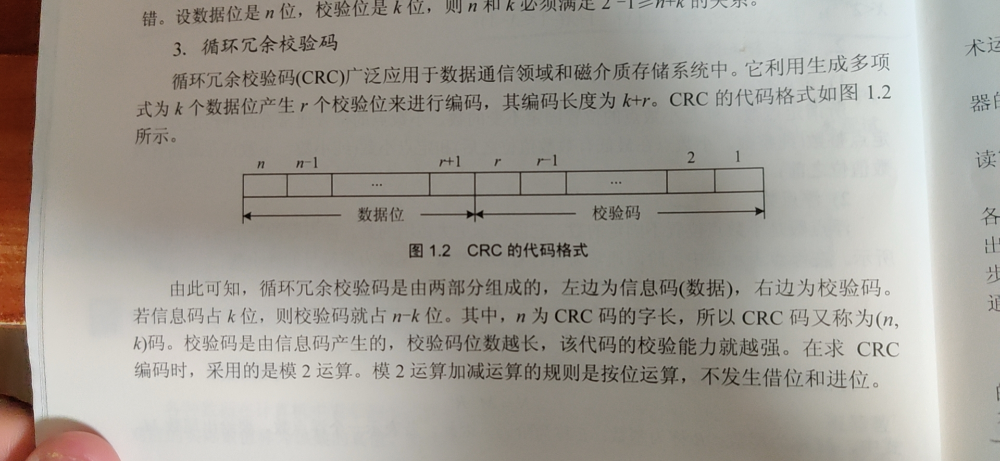
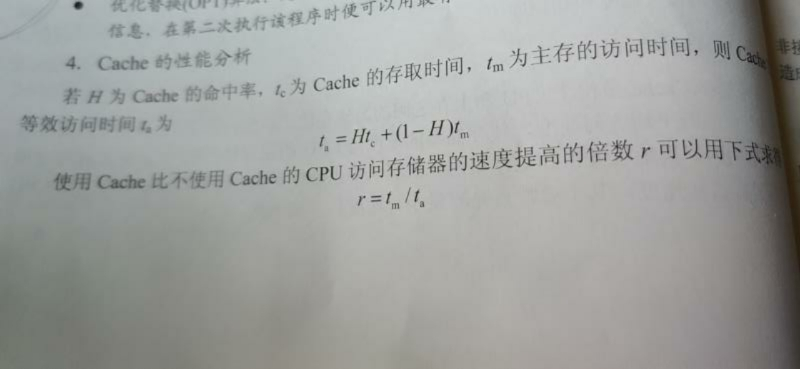
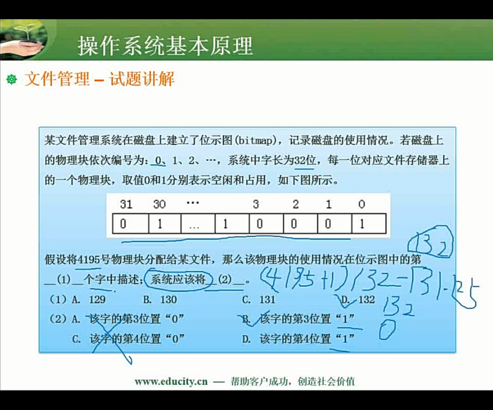
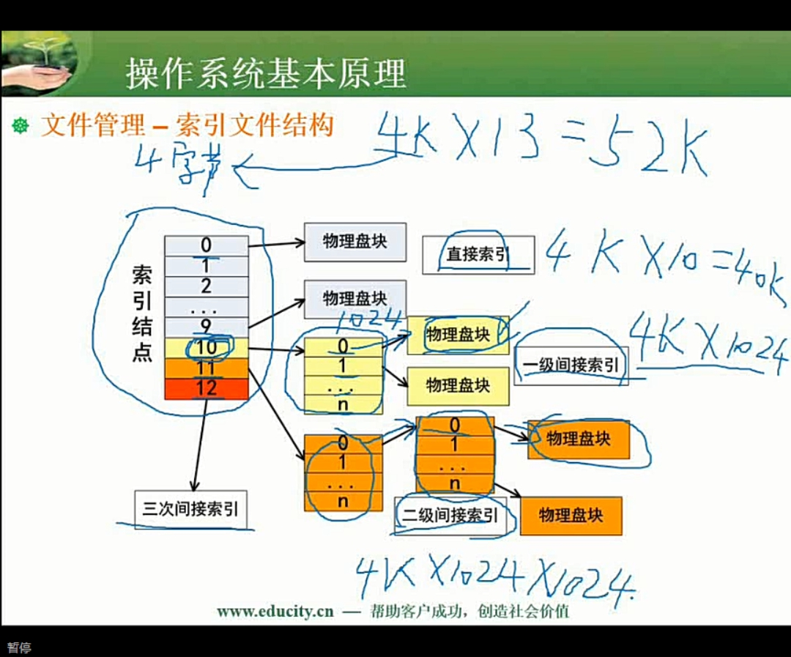
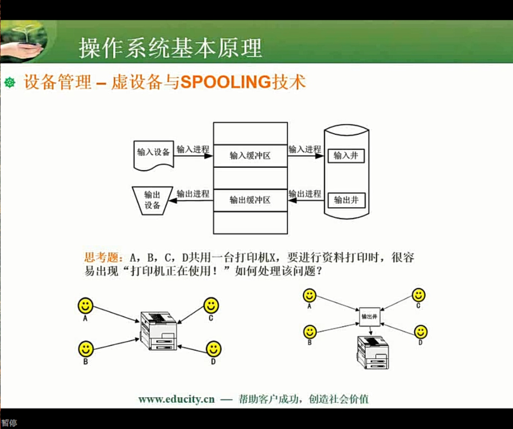
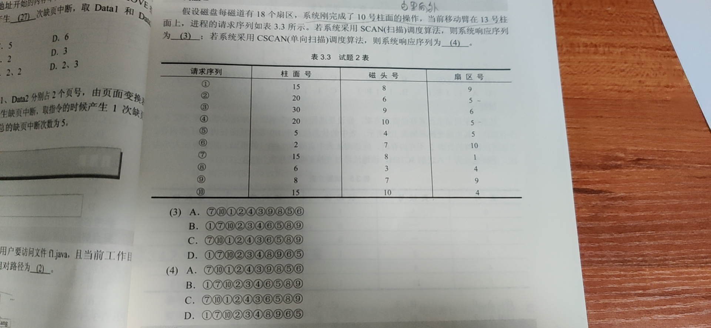
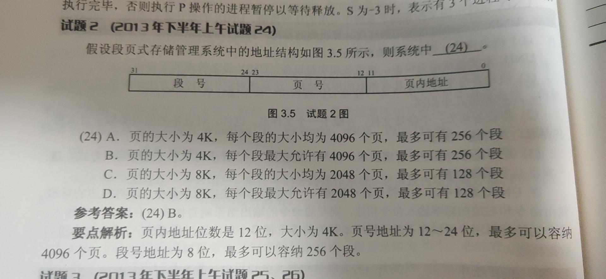
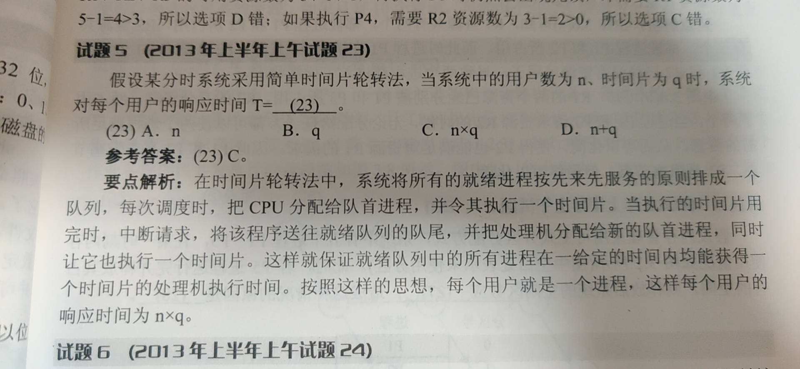
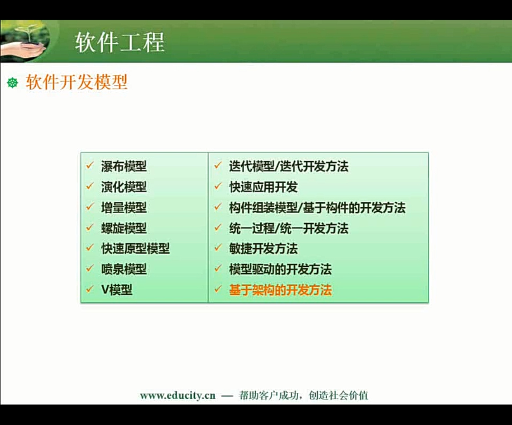

[TOC]

#  1.计算机系统知识

## 1.1原码反码补码移码

正数时

> 原=反=补

负数时

> 原转反：符号位不变，其余取反
>
> 反转补：最低位加1

移码：当偏移量为2的n-1次方时，**将补码符号位取反即可**

**零只有唯一补码**

## 1.2定点数浮点数

浮点数表示方法

```math
N = M*R^E
```

M为尾数，R为基数，E为阶码

## 1.3校验码

**确保数据传送无误**

> - 提高硬件电路的可靠性
> - 提高代码的检验能力


**奇偶校验码**：

使码距为2

> - 水平奇偶校验码
> - 垂直奇偶校验码
> - 水平垂直奇偶校验码

**海明码**：在数据位之间插入k个校验码，扩大码距来实现检错和纠错，

设数据位是n位，校验位k位，则满足

```math
2的k次方 -1 >= n+k
```


**循环冗余校验码(CRC)**

校验码越长，该代码校验能力越强，采用模2运算，其加减运算的规则是按位运算，不发生借位和进位



使用模2运算


## 1.4计算机系统硬件组成

**组成**

- 运算器
- 控制器
- 存储器
- 输入设备
- 输出设备

**中央处理单元(CPU)**

主要功能

> - 指令控制
> - 操作控制
> - 时间控制
> - 数据加工

组成

> - 运算器
>
> > - **算术逻辑单元(ALU)**:运算器重要组成部件，负责处理数据，实现对数据的算术运算和逻辑运算
> > - **累加寄存器(AC)**:通用寄存器，当ALU工作时，提供一个工作区
> > - **数据缓冲寄存器(DR)**:在对存储器进行读写操作室，用DR暂时存放由由内存储器读写的一条指令或一个数据字，并将不同时间段内读写的数据隔离开来
> > - **状态条件寄存器(PSW)**:主要分为状态标志和控制标志，这些标志通常分别由一位触发器保存，反映了当前指令执行完成之后的状态。一个算术操作产生一个运算结果，一个逻辑产生一个判决
>
> - 控制器
>
>   它决定了计算机运行过程的自动化
>
>  > - **指令寄存器(IR)**
>  > - **程序计数器(PC)**
>  > - **地址寄存器(AR)**
>  > - **指令译码器(ID)**
>
> - 寄存器组：控制器和运算器中的寄存器都是专用寄存器，通用寄存器可由程序员规定其用途

## 

## 1.5存储系统





**相联存储器**：按内容访问的存储器，通过关键字比较，可用在高速缓冲存储器中，在虚拟存储器中用来做段表等，还可用在数据库中

**高速缓存(Cache)**

目的：提高存储器平均访问速度，使存储器速度与cpu速度相匹配，地址变换和数据块的替换算法均由**硬件**实现。通常被集成到cpu的寄存器中，容小，速快，成高


常用的虚拟存储器由**主存-辅存**组成


## 1.6输入输出技术


1.7**总线结构**


系统总线：ISA,EISA,PCI

外部总线：PS-232-C,SCSI,USB,IEEE-1394


## 1.8指令系统

**CISC和RISC**


**吞吐率**


## 1.9题目总结

1. cache与主存的地址映像由**硬件**自动完成
2. 指令寄存器位数取决于**指令字长**
3. 逻辑异或：相等结果为0否则结果为1
4. 计算机字长32位，内存容量2GB，按字编址，寻址范围为**2GB/32位**
5. 常用虚存储器由**主存-辅存**组成
6. 中断向量可提供**中断服务程序的入口地址**
7. 实现多级中断嵌套，使用**堆栈**保护断点和现场
8. CRC格式为k+r
9. 定点表示法，**小数点不用存储位**
10. 某无条件转移汇编采用**直接寻址**，则该指令功能将指令中的地址码送入**PC(程序计数器)**
11. IO接口与主存采用**统一编址**，则输入输出操作是通过**访存**来完(统一编址是指IO端口与主存使用同一个地址空间进行统一编址)
12. **总线复用**，指数据和地址在同一个总线上传输的方式，可以**减少总线中信号线的数量**
13. CPU寄存器中，**指令寄存器**对用户是完全透明的

# 2.程序语言基础知识


## 2.1编译过程


**前端部分(与机器无关)**

> 词法分析，语法分析，语义分析，中间代码生成

**后端部分(与机器有关)**

> 代码优化，目标代码生成

**传值调用：**实参向形参传递相应类型的值，这种方式形参不能向实参传递信息。在C语言中，要实现被调用函数对实参的修改，**必须用指针作形参**。即调用时先对实参进行取地址运算，然后将实参地址传递给指针形参。这种方式实现了间接访问内存

**引用调用：**是c++增加的数据类型，当形参为引用类型时，**形参名实际上是实参的别名**，函数中对形参的访问和修改实际上就是针对相应实参所做的访问和改变

**实参可以使常量变量或表达式**

**常用中间代码有**：后缀式，三元式子，四元式和树

## 2.2文法


## 2.3有限自动机


## 2.4正规式


## 2.5表达式


## 2.6语言特点


## 2.7题目总结

1. 将高级语言翻译为机器语言程序的过程中，常引入**中间代码**，好处是**有利于进行与机器无关的优化处理，以及提高编译程序的可移植性**
2. 对高级语言源程序进行编译过程中，有穷自动机(NFA或DFA)是进行**词法分析**
3. 弱类型语言指不需要进行变量或对象类型声明的语言，例如**python**
4. **编译程序**和**解释程序**的相同点：在词法，语法，语义分析方面工作原理基本相同。不同点：在运行用户程序时，**解释程序**直接执行源程序或源程序的内部形式(中间代码)，因此不产生目标程序，而**编译程序**将源程序翻译成**目标程序**
5. 在对高级语言源程序进行编译过程中，为源程序变量所分配的存储单元的地址属于**逻辑地址**
6. 声明语句和可执行语句，对**声明语句**，主要是将需要的信息正确的填入合理组织的**符号表**中，对**可执行语句**，**则是翻译成中间代码或目标代码**
7. 
8. 
9. 
10. 
11. **数据类型说明**
    - 说明数据占用的内存和存放形式以分配存储单元
    - 对参与计算的对象进行检查
    - 规定数据的取值范围及能够的运算

# 3.操作系统知识

## 3.1基础知识


**特征**

1. 并发性
2. 共享性
3. 虚拟性
4. 不确定性

**功能**

1. **处理机管理**：对处理机执行时间管理，采用多道程序等技术将CPU合理分配每个人物。常用资源管理单位有**进程**和**线程**
2. **文件管理**
   1. 文件存储空间
   2. 目录
   3. 文件的读写
   4. 存取控制
   5. 软件
3. **存储管理**：对主存空间管理
4. **设备管理**：方便设备使用，提高CPU和I/O设备的利用率
5. **作业管理**
   1. 任务管理
   2. 界面管理
   3. 人机交互

**类型**

1. **批处理操作系统**
2. **分时操作系统**
3. **实时操作系统**
4. **网络操作系统**
5. **分布式操作系统**
6. **微机操作系统**
7. **嵌入式操作系统**

## 3.2处理机管理

### 3.2.1前趋图

### 3.2.2进程的同步与互斥


### 3.2.3PV操作

**定义**


**例题**


**PV操作与前趋图**


### 3.2.4进程调度

**分类**

- 可剥夺式
- 不可剥夺式

**算法**

1. **先来先服务(FCFS)**：总是将就绪队列队首的进程投入运行，特点**有利于长作业，不利于短作业，有利于CPU繁忙的作业，不利于I/O繁忙的作业**。宏观调度。
2. **时间片轮转**：提高进程并发性和响应时间，从而**提高资源利用率**。微观调度。
3. **优先级调度**
   1. 静态优先级：创建时就已经确定好，知道进程终止都不改变
   2. 动态优先级：可以改变
4. **多级反馈调度**：照顾短进程，提高系统吞吐量，缩短平均周转时间，照顾I/o型进程以获得较好的I/O设备利用率，缩短响应时间

### 3.2.4死锁

**原因**

- 资源竞争
- 进程推进顺序非法

**产生死锁的4个必要条件**

- 互斥条件:一次只允许一个进程使用
- 请求保持条件：获得后又请求资源被堵塞
- 不可剥夺条件：进程在未结束前不能所获得的资源不能被剥夺
- 环路条件：每个进程占有下个进程申请的资源

**死锁处理**

- 预防：破坏4个条件中一个，措施是**静态分配法**和**资源有序分配法**
- 避免：银行家算法
- 检测：系统定时运行死锁检测程序
- 解除
  - 资源剥夺法
  - 撤销进程法

### 3.2.5线程

比进程小，是进程的实体，是系统独立分配和调度的基本单位，也有就绪，阻塞，运行三种状态

### 3.2.6银行家算法

缺

- 银行家算法
- 银行家例题1
- 银行家例题2
- 银行家例题3

## 3.3存储管理

### 3.3.1分配算法

缺

- 存储分配算法

### 3.3.2页，段，段页式存储

**页式存储**

缺

- 页式存储
- 页式存储练习题

**段式存储**

缺

- 段式存储

**段页式存储**

缺

- 段页式存储

**快表**

如果题目没有使用块表，则程序要访问**2**次内存，第一次是查表，第二次是查到后访问对应的块

缺

- 块表

### 3.3.3页面置换算法

**缺页**

访问内存时没有想要访问的页面，此时产生一次缺页

**抖动**

分配页面更多反而缺页率更高

缺

- 分配算法例题.jpg

### 3.3.4页面淘汰算法

指令跨页时产生一次缺页中断，操作数跨页会产生两次缺页中断

缺

- 页面淘汰算法练习题

## 3.4文件管理

### 3.4.1文件和树形目录结构

主要考察绝对路径和相对路径

缺

- 文件和树形目录结构.jpg

### 3.4.2空闲存储空间管理

**位示图法**

字长代表一个字有多少个物理块





### 3.4.3索引文件结构



例题


## 3.5设备管理

### 3.5.1数据传输控制方式


### 3.5.2虚拟设备和spooling技术




### 3.5.3磁盘调度

**算法**

1. 扫描算法：从里到外，然后再从外到里
2. 单向扫描算法，从里到外后到最外面是，再从最开始的里面到外面

例题



解析


## 3.6作业管理

**组成**

- 程序
- 数据
- 作业说明书：体现用户的控制意图

**作业控制**

- 脱机：无需人工干预，用户必须提交作业说明书
- 联机：需要人工干预，用户可以通过终端提交意图

**作业状态及其转换**

- 提交
- 后备：通过spooling系统
- 执行
- 完成：通过spooling系统输出

**作业调度算法**

- 先来先服务(FCFS)
- 短作业优先(SJF)
- 响应比高优先
- 优先级调度算法
- 均衡调度算法

## 3.7题目总结

1. 
2. 

   

# 4.系统开发和运行

## 4.1基础知识

### 4.1.1开发模型



**瀑布模型**

> **需求明确**，二次开发时选用，无法灵活应对需求


**演化模型**

> 根据需求快速开发一个可运行版本，然后不断改进，**主要用于对软件需求缺乏准确认识**

**螺旋模型**

> 包括
>
> 1. 制定计划
> 2. 风险分析
> 3. 实施工程
> 4. 客户评估
>
> 瀑布模型和演化模型的结合，在这之上增加了风险分析

**喷泉模型**

> 主要用于描述面向对象的开发过程，具有迭代和无间隙特性

**V模型**

强调测试的模型，测试贯穿始终


### 4.1.2软件开发方法

1. **结构化方法**

   > 面向**数据流**，自顶向下，逐层分解，最早出现的方法，适合于数据处理领域问题，不适合解决大规模复杂的项目，难以适应需求的变化

   

2. **Jackson**方法

   > 面向**数据结构**，以数据结构为驱动

   

3. **原型化方法**

   > **适合需求不明确时**

   

4. **面向对象开发方法**

   > 统一建模语言UML

### 4.1.3软件需求分析

### 4.1.4软件开发项目管理

1. 成本估算
2. 风险分析
3. 进度管理
   1. **Gantt图**：横坐标时间，纵坐标任务，**能清晰的描述任务何时开始何时结束以及各个人物的并行性，不能反映任务的依赖关系，难以确定项目的关键**
   2. **PERT图**：不仅有上面的优点，**还给出了任务间的关系**
4. 人员管理

### 4.1.5软件配置管理

1. 基线
2. 软件配置项
3. 版本控制
4. 变更控制

### 4.1.6软件过程管理

**软件能力成熟度模型(CMM)**

1. 初始级：无序混乱
2. 可重复级：建立了基本的项目管理
3. 已定义级：已将软件管理和工程过程文档化，标准化
4. 已管理级：收集对软件过程和产品质量的详细度量
5. 优化级：过程的量化反馈和先进的思想

**统一过程模型(UP)**

> 用例和风险驱动，以架构为中心，迭代并且增量

四个阶段

1. 初始阶段
2. 精化阶段
3. 构建阶段
4. 移交阶段

典型代表**RUP**

**敏捷开发**

> 总体目标：尽可能早地，持续地对有价值的软件的交付

极限编程(XP)

### 4.1.7软件质量管理

**软件质量特性**

1. 功能性：与一组功能及其指定的性质有关的一组属性
2. 可靠性：一定时间，软件维持其性能水平有关
3. 易使用性：为使用软件使用的努力
4. 效率：规定条件下，软件性能水平与所用资源量关系
5. 可维护性：进行规定修改所需努力
6. 可移植性：到另外环境的能力

**软件质量保证**

**软件复杂性**

度量方法

1. 代码行度量方法：统计程序的源代码行数，以此来为指标
2. McCabe度量法：取决于控制的复杂性

**软件评审**

**软件容错技术**

实现手段主要是**冗余**

1. 结构冗余
2. 信息冗余
3. 时间冗余
4. 冗余附加技术

## 4.2系统分析

## 4.2.1结构化分析方法

> 面向数据流的需求分析方法，适用于分析大型数据处理系统

**数据流图**

底部


# 5.网络基础知识

# 6.多媒体基础知识

# 7.数据库技术

